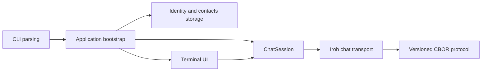

# Rathole Architecture

This document is a map of the current implementation. It explains which layer owns a responsibility and where a detailed contract lives. It is not a product roadmap and does not replace the engineering rules in [`AGENTS.md`](../AGENTS.md).

## Runtime shape

The main boundaries are:

- `src/cli.rs` parses command-line arguments.
- `src/application.rs` bootstraps identity, storage, logging, the chat session, and the TUI.
- `src/domain/` contains product concepts that do not depend on Ratatui, Crossterm, filesystem access, or Iroh runtime objects.
- `src/storage/` owns the device-key and contact repositories.
- `src/network/` owns the Iroh identity boundary and online chat transport.
- `src/protocol/` owns the standalone v1 CBOR document contract. See [`src/protocol/README.md`](../src/protocol/README.md).
- `src/tui/` owns Ratatui rendering, input mapping, local presentation state, and UI effects.

## Identity and contacts

The current MVP exposes the local Iroh `EndpointId` as the peer ID shown in the TUI. The normal profile keeps the device secret in the operating-system keychain. The `just dev` profile uses a separate file-backed development identity; its storage details are in [`development.md`](development.md).

Contacts are local and one-way. Adding a contact validates and stores an `EndpointId`; it does not prove that the peer is online, reachable, or willing to communicate. The chat transport authorises incoming traffic by comparing the authenticated Iroh peer identity with this local contact allowlist.

The planned durable `UserPeerId`, recovery phrases, and multi-device identity model are not implemented in the current MVP. When that work begins, the durable user identity must remain separate from per-device Iroh transport identities.

## Chat session flow

For a normal TUI launch:

1. The application loads or creates the local device identity.
2. It loads the local contacts and initialises the flushed JSONL logger.
3. It starts one `ChatSession` and one Iroh chat transport for the TUI session.
4. The transport creates one peer session per local contact and reports `Connecting`, `Connected`, or `Not connected` as local connection state. These states are not presence claims.
5. A reachable peer uses one long-lived Iroh connection, while each message is exchanged on its own bidirectional stream.
6. Message bodies, delivery state, unread counts, drafts, and connection state remain in memory. Restarting the application clears them.

The current chat is online-only. It has no offline mailbox, durable message history, automatic retry, read receipt, presence exchange, multi-device synchronisation, user account, or file transfer.

The meaning of `Delivered` is intentionally narrow: the remote Rathole runtime accepted the message and returned the transport receipt. It is not a read receipt and does not make the message durable.

The detailed transport boundary, stream lifecycle, limits, and deadlines are documented in [`src/network/chat/README.md`](../src/network/chat/README.md). The wire-level frames and encoding rules are documented in [`src/protocol/README.md`](../src/protocol/README.md).

## TUI boundary

`TuiApp` is the application-facing TUI orchestrator. It owns `TuiData`, global panel focus, the selected `UiConfig`, application status, and the application of `UiCommand` values. Components keep temporary presentation state such as selections, drafts, cursors, scroll positions, and modal choices locally.

Renderers receive typed props, component configuration, and theme data. They render without mutating application data; requested mutations are returned as UI commands and validated by `TuiApp`. The complete contributor-facing TUI rules are maintained in [`AGENTS.md`](../AGENTS.md#tui-component-architecture).

## Documentation map

- [`README.md`](../README.md) — product overview, current MVP, requirements, quick start, and basic controls.
- [`development.md`](development.md) — contributor setup, local development identity, validation, and OpenSpec workflow.
- [`diagnostics.md`](diagnostics.md) — collecting and correlating paired chat diagnostic logs.
- [`src/protocol/README.md`](../src/protocol/README.md) — strict v1 CBOR wire contract.
- [`src/network/chat/README.md`](../src/network/chat/README.md) — Iroh chat transport contract.
- [`AGENTS.md`](../AGENTS.md) — engineering, security, architecture, and TUI implementation rules.
- [`openspec/config.yaml`](../openspec/config.yaml) — concise context used when OpenSpec creates change artifacts.
